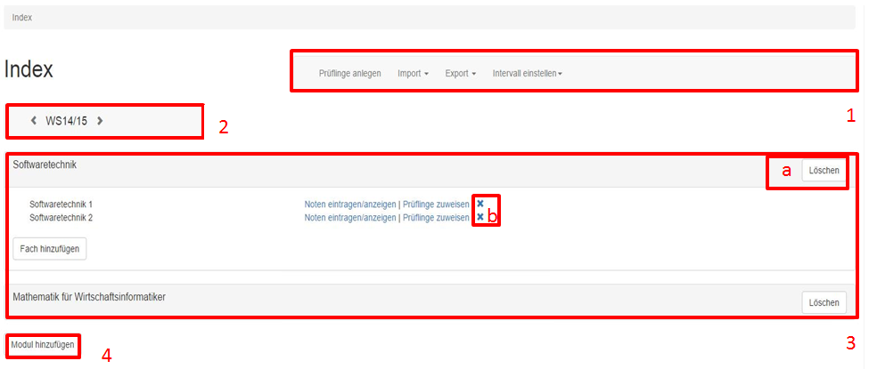
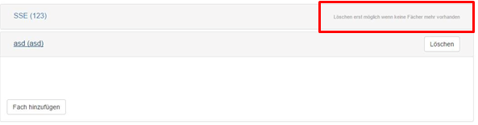
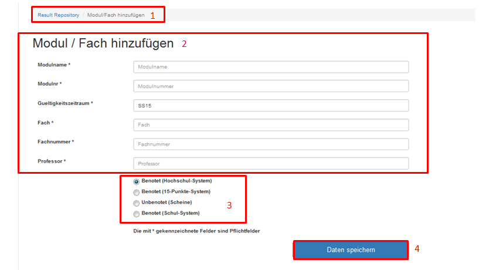
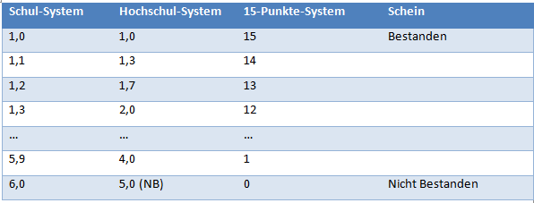
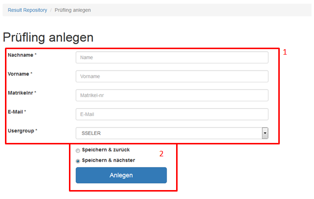
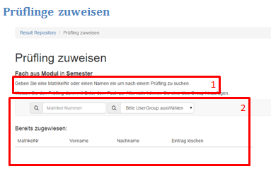
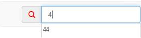
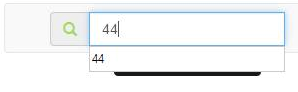
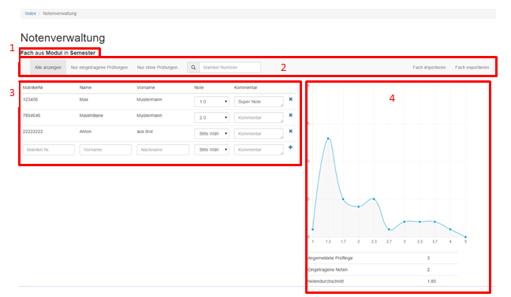

User-Manual examiner
====================

Einführung
----------

In dieser Anwenderdokumentation werden die Funktionen zu der Typo3 Extension „Result Repository“ beschrieben und im Einzelnen erklärt. Die Extension dient in erster Linie dazu Noten zu verwalten. Es können dabei Module und die zugehörigen Fächer angelegt und mit den entsprechenden Prüflingen belegt werden.

Sartseite/Result Repository
---------------------------

Die folgende Abbildung zeigt die Startseite des Backends.

**Zu 1.**

In der rechtsoben angeordneten Menüleiste, befinden sich die einzelnen Funktionen zum Anlegen neuer Prüflinge, zum Import und Export, sowie zur Einstellung der Intervalllänge. Unter „Prüflinge anlegen“ können neue Prüflinge in der Extension angelegt werden. Wenn eine Liste von mehreren Prüflingen vorhanden ist, kann diese mit Hilfe der Import-Funktion importiert werden. Es können außerdem Prüflinge, Module und Fächer exportiert werde. Unter dem Menüpunkt „Intervall einstellen“ kann zwischen Studienhalbjahr und Schuljahr gewechselt werden. Somit können Sie diese Extension sowohl im Studium als auch in der Schule verwenden.

**Zu 2.**

Hier kann je nach eingestelltem Intervall zwischen den einzelnen Semestern oder Schuljahren gewechselt werden.

**Zu 3.**

In diesem Abschnitt werden alle bisher angelegten Module aufgelistet. Mit einem Klick auf ein Modul werden die Fächer, die diesem Modul zugewiesen wurden, angezeigt. Der Button „Fach hinzufügen“ fügt dem Modul ein neues Fach hinzu. Über „Noten eintragen/anzeigen“ können direkt zu dem entsprechenden Fach Noten eingetragen oder angezeigt werden. „Prüflinge zuweisen“ ermöglicht es, dass Sie dem davor stehenden Fach Prüflinge zuweisen können. Mit dem Symbol x (b) kann das entsprechende Fach gelöscht werden. Falls Sie gleich das ganze Modul löschen möchten, können Sie dies über den Lösch-Button (a) erledigen.Dies ist erst möglich, wenn alle in dem Modul befindlichen Fächer bereits gelöscht sind.

**Zu 4.**

Wenn Sie ein neues Modul (inklusive ein Fach) hinzufügen möchten, können Sie dies über den Button „Modul hinzufügen“ (4) durchführen.

Modul/Fach hinufügen
--------------------

Auf dieser Seite (Abb. 5) können Sie die Einstellungen für ein neues Modul und Fach festlegen.

**Zu 1.**

Hier wird der Pfad zur aktuellen Seite angezeigt. Durch Klick auf die in blau angezeigten Seiten-Namen gelangt man zu der jeweiligen Seite.

**Zu 2.**

Dieses Formular dient dazu, ein neues Modul und ein neues Fach anlegen zu können.

**Zu 3.**

Über diese Auswahl-Buttons kann die Art der Bewertung ausgewählt werden. Es kann zwischen der Eintragung von Schulnoten (Schul-System bzw. 15-Punkte-System) und Prüfungs- bzw. Schein-Leistungen für Hochschulen (Hochschul-System bzw. Schein) unterschieden werden.

In der nachfolgenden Tabelle (Abb. 5) wurden die Benotungs-Systeme gegenübergestellt.

**Zu 4.**

Durch Klick auf den Button (4) werden die Eingaben gespeichert.

Nach dem Speichervorgang gelangen Sie wieder auf dem Startbildschirm. Jetzt können Sie, durch den Button „Prüfling anlegen“ in der Menüleiste oben rechts Prüflinge anlegen und diese anschließend  dem Fach zuordnen. Es erscheint die folgende Ansicht (Abb. 6).

Prüfling anlegen
----------------

Sofern Sie keine Prüflingsdaten importiert haben (Startseite) müssen Sie die Prüflinge zunächst anlegen bevor Sie mit der Anmeldung bzw. Zuordnung der Prüflinge zu einem Fach beginnen können.
Das nachfolgende Formular (Abb. 6) muss manuell gefüllt werden.

**Zu 1.**

In dieses Formular geben Sie die Daten des Prüflings ein.

**Zu 2.**

Hierüber wird Ihre Eingabe gespeichert und der neue Prüfling angelegt. Parallel wird ein Typo3 Frontend User angelegt und der Prüfling erhält automatisch eine E-Mail mit seinen Zugangsdaten an die eigetragene E-Mail-Adresse.

Nachdem Sie die Prüflinge angelegt haben, müssen Sie diese Ihrem Fach noch zuwiesen. Dies können Sie über „Prüflinge zuweisen“ (Abbildung 1 -> Punkt 3 -> Prüflinge zuweisen) erledigen.

Prüfling zuweisen
-----------------

**Zu 1.**

In der Suchleiste können Sie anhand der Matrikelnummer Prüflinge suchen und durch Bestätigung der Enter-Taste Ihrem Fach zuweisen. Es wird automatisch überprüft, ob die Matrikelnummer vorhanden ist.

Des Weiteren besteht außerdem die Möglichkeit durch eine Benutzergruppe gleich mehrere Prüflinge auf einmal zuzuweisen, allerdings muss diese Benutzergruppe erst manuell angelegt werden.

**Zu 2.**

Hier werden alle bereits zugewiesenen Prüflinge angezeigt.
Nachdem Sie Prüflinge einem Fach zugewiesen haben, können die Noten eingetragen werden.

Notenverwaltung
---------------

Auf dieser Seite (Abb. 7) können Sie die Noten Ihrer Studenten bzw. Schüler verwalten.

**Zu 1.**

Hier können Sie genau erkennen bei welcher Prüfungsleistung (Fach, Modul und Semester) Sie sich gerade befinden.

**Zu 2.**

Hier können Sie die Prüflinge nach verschiedenen Kriterien filtern. Außerdem besteht die Möglichkeit Prüflinge anhand der Matrikelnummer oder des Nachnamens zu suchen und dann zu bearbeiten. Außerdem haben Sie hier die Möglichkeit ein Fach zu importieren oder zu exportieren.

**Zu 3.**

Hier werden alle Prüflinge angezeigt, welche zu Ihrer Auswahl (2) passen. Die Note kann durch ein Drop-Down-Menü ausgewählt werden. Optional können Sie der Note einen Kommentar hinzufügen.
In der letzten Zeile kann ein zusätzlicher Prüfling dem Fach hinzugefügt und eine Note zugewiesen werden.

**Zu 4.**

Hier sehen Sie die statistische Auswertung des Fachs.
