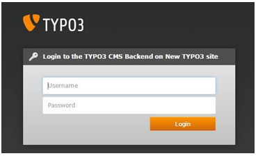
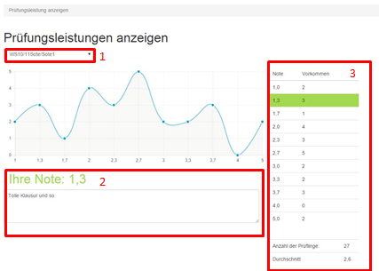

.. ==================================================
.. FOR YOUR INFORMATION
.. --------------------------------------------------
.. -*- coding: utf-8 -*- with BOM.

.. include:: ../Includes.txt

Anwender-Dokumentation Prüfling
===============================

Anmeldung
---------

Wenn ein neuer Prüfling angelegt wird, erhält er eine E-Mail mit seinen Zugangsdaten.

Nach Eingabe des Benutzernamens und Passworts (Abb. 9)  gelangt der Prüfling auf die folgende Ansicht (Abb. 10).

Prüfungsleistungen anzeigen
---------------------------

**Zu 1.**

Hier kann der Prüfling zwischen den Fächern/Semestern wechseln.

**Zu 2.**

Seine Note sowie gegebenenfalls der Kommentar  des Prüfers werden unterhalb der Grafik angezeigt

**Zu 3.**

Auf der rechten Seite werden die Häufigkeit der einzelnen Noten und die Durchschnitts-Note für dieses Fach angezeigt.

