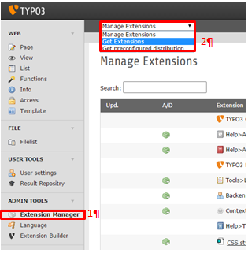
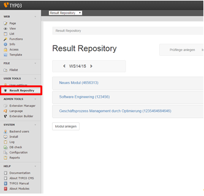

.. ==================================================
.. FOR YOUR INFORMATION
.. --------------------------------------------------
.. -*- coding: utf-8 -*- with BOM.

.. include:: ../Includes.txt

.. _insallaion:

Installation
============

Erste Schrite
-------------

Um dieses Modul verwenden zu können, benötigen Sie Typo3 in der Version 6.2. oder neuer.
Zuerst muss die Extension installiert werden. Dazu suchen Sie unter „Extension Manager“ (1) nach „result repository“ oder „rere“. Wichtig ist hierbei, dass Sie die Drop-down Liste (2) auf „Get Extension“ gestellt haben.

Zur Installation müssen Sie auf den Legostein neben dem Extension Namen klicken.
Nachdem Sie die Seite neu geladen haben, befindet sich das Backend der Extension im Unterpunkt „User Tools“, wie Sie in Abbildung 2 sehen können.

