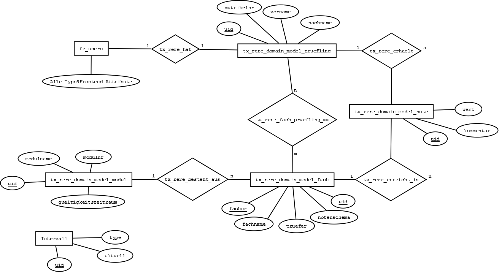

.. ==================================================
.. FOR YOUR INFORMATION
.. --------------------------------------------------
.. -*- coding: utf-8 -*- with BOM.

.. include:: ../Includes.txt

.. _admin-manual:

Entwickler-Dokumentation
========================

Programmiersprache
------------------

Die Backend-Erweiterung wird mit PHP programmiert und in das Typo3-Framework
integriert. Das Frontend wird durch HTML5 und CSS unter Einbindung des Bootstrap Frameworks dargestellt und mit JavaScript zur Laufzeit dynamisiert. Dies geschieht unter Zuhilfenahme der Bibliotheken JQuery und Chartjs.

Benutzerverwaltung
------------------

Benutzerrechte können über die Typo3-Nutzenverwaltung geregelt werden.
Dabei besteht die Möglichkeit Benutzer hinzuzufügen,zu löschen und einzelnen Benutzern
verschiedene Rechte zu erteilen.

Klassen Definition
------------------

Das PHP doc ist erst nach der Installation aufrufbar. Sie findes es unter dem Menüpunkt **Hilfe**.

Datenbank
---------

Die Persistierung der erhobenen Daten erfolgt über das Typo3-Framework in das folgende Datenbankschema.

